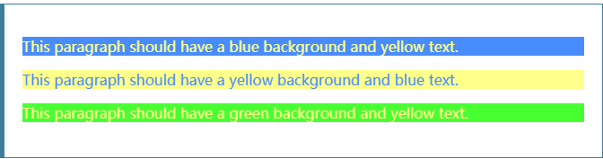

# css变量

## Custom properties (--*): CSS variables

>前缀为--（例如--）的属性名表示自定义属性，其中包含一个可以在使用var（）函数的其他声明中使用的值。
>
>自定义属性的作用域是它们在其上声明的元素，并参与级联：此类自定义属性的值是由级联算法决定的声明的值。

```html
<p id="firstParagraph">This paragraph should have a blue background and yellow text.</p>
<p id="secondParagraph">This paragraph should have a yellow background and blue text.</p>
<div id="container">
  <p id="thirdParagraph">This paragraph should have a green background and yellow text.</p>
</div>
```

```css
:root {
  --first-color: #488cff;
  --second-color: #ffff8c;
}

#firstParagraph {
  background-color: var(--first-color);
  color: var(--second-color);
}

#secondParagraph {
  background-color: var(--second-color);
  color: var(--first-color);
}

#container {
  --first-color: #48ff32;
}

#thirdParagraph {
  background-color: var(--first-color);
  color: var(--second-color);
}
```

result


