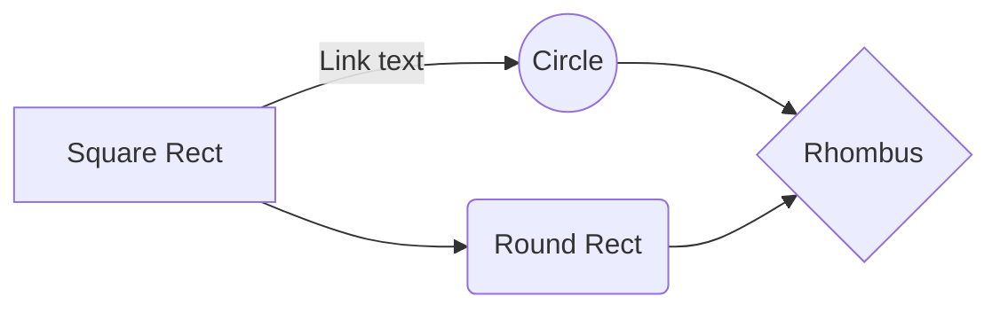

1. crystal 语言
  发现方式：github - explore
  特点：fibers 回调地狱

```js
<script type="text/javascript">
  function stop() {
    return false;
  }
  document.oncontextmenu = stop;
</script>
```
禁用鼠标右键

```css
-webkit-user-select:none;
-moz-user-select:none;
-ms-user-select:none;
user-select:none;
```
css禁止用户选中

http://www.epx365.cn/peixun/software/201841185.html

https://www.cnblogs.com/

https://bbs.csdn.net/

https://www.cnblogs.com/findumars/p/6702161.html

http://www.itpub.net/

http://bbs.chinaunix.net/

http://bbs.chinaunix.net/

https://opensource.org/licenses/MIT

https://apps.wordpress.com/desktop/

https://developer.wordpress.com/calypso/#background


2. mermaid



3. katex

vue-katex/(react-latex, react-katex), canvas-latex

$$
\Gamma(z) = \int_0^\infty t^{z-1}e^{-t}dt\,.
$$