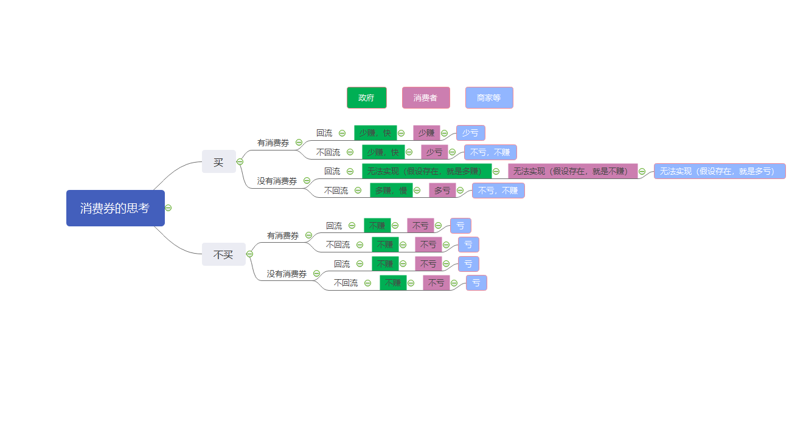

# 围绕消费券的思考

## 消费券的本质

不论有没有消费券，消费者买还是不买，买了回流还是不回流，政府都是赚的，无非就是赚多赚少，赚快赚慢的区别。

相当于大家从政府那里拿了点工资，一起为政府的税收事业积极打工，创造短时间内更好的税收业绩，但是单个商品的税收减少了。

## 回流与不回流

不回流，消费者拿到了优惠，相当于是消费者从政府那里拿到了点调味品，然后开开心心的吃了自己想吃的饭，赢了税收，亏了自己的钱包。

回流，大家分享着政府给发的工资，创造短时间内的税收，实则没有实现了商品的价值，赢了税收，亏了社会资源。

## 买与不买

买了，不论有没有消费券，买了回流还是不回流，政府都是赢家，买了不回流，自己亏腰包，买了回流，亏社会资源。

没买，那么政府没有赢，自己也没有亏，社会资源倒是白白浪费了。

## 总结

买还是不买？要不要消费券？买了后回流还是不回流？看树图

**买卖不存在**的情况，只有一种结果，亏的是社会资源，消费者没损失，政府没税收。

**买卖存在**的情况下，分**有消费券回流（没有消费产生）**，**有消费券不回流**和**没有消费券不回流**三种情况，第四种情况**没有消费券回流（没有消费产生）**不存在。

|       角色       | 有消费券回流（没有消费产生） | 有消费券不回流 | 没有消费券不回流 | 没有消费券回流（没有消费产生） |
| :--------------: | :--------------------------: | :------------: | :--------------: | :----------------------------: |
|       政府       |           少赚，快           |    少赚，快    |     多赚，慢     | 不存在 （假设存在，就是多赚）  |
|      消费者      |             少赚             |      少亏      |       多亏       | 不存在 （假设存在，就是不赚）  |
| 商家（社会资源） |             少亏             |   不亏，不赚   |    不亏，不赚    |  不存在（假设存在，就是多亏）  |

看完图和表的说明，总结一下：

在政府角度，消费券的存在，无非是快慢的问题，缩短了时间，损失了单价，换来了短期高税收。

在消费者角度，只要存在消费，无非是多亏少亏的问题。

在商家（社会资源）角度，不存在消费就是伤害，消费券的作用无非是少亏多亏的问题；存在消费，消费券与自己无关，这解释了消费券作用对象是消费者。

消费券，实质是政府降低了税率，刺激了消费，提高了短时间内的总税收。

有意思的是，**有消费券回流**的情况。这种情况下，没有消费的产生，却产生了税收，而且其他角色分了政府降低税率的一杯羹。乍一看。。。
